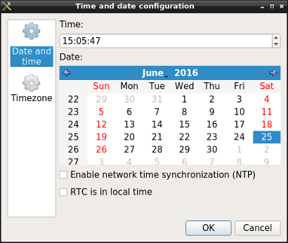
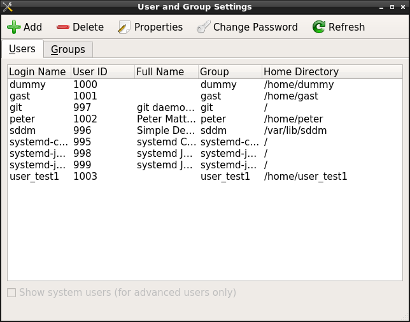

# lxqt-admin

## Overview

This repository is providing two GUI tools to adjust settings of the operating
system LXQt is running on.

Both are using [polkit](https://www.freedesktop.org/wiki/Software/polkit/) to
handle permissions. In contrast to the specific backends described below earlier
versions of lxqt-admin were relying on
[system-tools-backends](http://system-tools-backends.freedesktop.org) and their
wrapper [liboobs](https://github.com/GNOME/liboobs). These were replaced as both
go unmaintained for years and were hence dropped from many distributions heavily
restricting the usage of lxqt-admin. As long as they can be built it should still
be possible to compile lxqt-admin release ≤ 0.10 against them in order to make
use of it on platforms lacking systemd like BSD.

### Time and date configuration

Adjusts time and date. Binary is `lxqt-admin-time`.

It is using `systemd-timedated` as backend which is accessed by its D-Bus
interface. Among other this means the option to sync the system time by NTP is
relying on `systemd-timesyncd` as backend.

### User and Group Settings

Management of users and groups. Binary is `lxqt-admin-user`.

The backend is a script `lxqt-admin-user-helper`. By default it is in turn using
the shadow tools to do the actual work. The script can be modified to use
different tools, though.

## Installing

### Compiling sources

Runtime dependencies are polkit and [liblxqt](https://github.com/lxqt/liblxqt).
A polkit agent should be available with
[lxqt-policykit](https://github.com/lxqt/lxqt-policykit/) representing the first
choice in LXQt. Additional build dependencies are CMake and optionally Git to pull
latest VCS checkouts. The localization files were outsourced to repository
[lxqt-l10n](https://github.com/lxqt/lxqt-l10n) so the corresponding dependencies
are needed, too. Please refer to this repository's `README.md` for further
information.

Code configuration is handled by CMake. CMake variable `CMAKE_INSTALL_PREFIX`
will normally have to be set to `/usr`.

To build run `make`, to install `make install` which accepts variable `DESTDIR`
as usual.

### Binary packages

#### Arch Linux

[AUR](https://aur.archlinux.org) packages `lxqt-admin` and `lxqt-admin-git` are
providing the current stable release and the actual master checkout at compile
time as usual.
Note that package `lxqt-admin` had to be kept in the AUR due to lack of the
dependency liboobs as depicted [above](#overview). So it will be transferred to
community as of release 0.11.

#### Debian

Package `lxqt-admin` is available in the official repositories as of Debian stretch.

#### Fedora

Fedora doesn't provide lxqt-admin so far due to lack of the dependency liboobs
as depicted [above](#overview). This will hopefully change once release LXQt
release 0.11 makes it into the Fedora repositories.

#### openSUSE

openSUSE does not ship with lxqt-admin in it's standard repositories since the
functionality is covered by openSUSE's [YaST](http://yast.github.io/).
However it is still possible to install it on openSUSE. The package and its
dependencies, like the [above](#overview) mentioned, outdated liboobs are
available through the [X11:LXQt](https://build.opensuse.org/project/show/X11:LXQt)
repository.

## Usage

Much like similar tools provided by [lxqt-config](https://github.com/lxqt/lxqt-config)
the tools of lxqt-admin can be launched from the
[Configuration Center](https://github.com/lxqt/lxqt-config#configuration-center)
as well as from the panel's main menu - Preferences - LXQt settings.

The actual usage should be self-explanatory. To apply settings the GUI of the
polkit authentication agent that's in use is launched to acquire the root password.

## Translation (Weblate)

