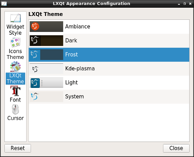
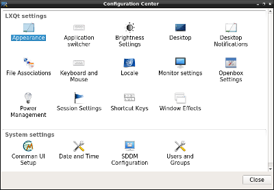

# lxqt-config

## Overview

This repository is providing several tools involved in the configuration of both
LXQt and the underlying operating system.

On the one hand it is featuring several GUI tools to configure topics like
general appearance, pointer devices or screen resolutions. On the other hand
there's a GUI "Configuration Center" which summarizes all those configuration
tools as well as counterparts of other LXQt components or third-party
applications.

### Configuration GUI tools

#### LXQt Appearance Configuration

Appearance of LXQt, that is topics like icon and LXQt theme or fonts.

Binary `lxqt-config-appearance`.

#### Brightness

Brightness settings of output devices.

Technically colors are adjusted to simulate varying brightness if the system
LXQt is running on doesn't allow for adjusting the brightness itself.

Binary `lxqt-config-brightness`.

#### File Associations

Assigns MIME types to applications used to handle them. Not too user-friendly so
far, see e. g. discussion in https://github.com/lxqt/lxqt/issues/433.

Binary `lxqt-config-file-associations`.

#### Keyboard and Mouse

Configures hardware of pointer devices. Settings like repeat delay and interval
of keyboards or acceleration of pointer devices.

Binary `lxqt-config-input`.

#### Locale

Locale used within LXQt sessions. Basically this GUI sets the well-known
environment variables like `LANG` or `LC_*`. The settings apply to the session
as a whole, that is to applications running within LXQt sessions but not
belonging to LXQt, too.

Binary `lxqt-config-locale`.

#### Monitor Settings

Adjusts screen resolutions, positioning of screens and the likes.

Binary `lxqt-config-monitor`.

### Configuration Center

The "Configuration Center" (binary `lxqt-config`) is summarizing and providing
various configuration GUIs.

First of all these are the ones belonging to repository lxqt-config described
[above](https://github.com/lxqt/lxqt-config#configuration-gui-tools). Next, it
is hosting counterparts of several other LXQt components like "Desktop
Notifications" of [lxqt-notificationd](https://github.com/lxqt/lxqt-notificationd),
"Shortcut Keys" of [lxqt-globalkeys](https://github.com/lxqt/lxqt-globalkeys)
or the tools provided by [lxqt-admin](https://github.com/lxqt/lxqt-admin).
Third-party applications can include their configuration tools in
"Configuration Center", too. This applies e. g. to "Connman UI Setup" of
[cmst](https://github.com/andrew-bibb/cmst) or "SDDM Configuration" of
[sddm-config-editor](https://github.com/hagabaka/sddm-config-editor).

## Installation

### Compiling source code

Runtime dependencies are Xcursor, qtsvg, KScreen and
[liblxqt](https://github.com/lxqt/liblxqt).  Additional build dependencies are
CMake and optionally Git to pull latest VCS checkouts. The localization files
were outsourced to repository [lxqt-l10n](https://github.com/lxqt/lxqt-l10n) so
the corresponding dependencies are needed, too. Please refer to this repository's
`README.md` for further information.

Code configuration is handled by CMake. CMake variable `CMAKE_INSTALL_PREFIX`
has to be set to `/usr` on most operating systems, depending on the way library
paths are dealt with on 64bit systems variables like `CMAKE_INSTALL_LIBDIR` may
have to be set as well.

To build run `make`, to install `make install` which accepts variable `DESTDIR`
as usual.

### Binary packages

The library is provided by all major Linux distributions like Arch Linux, Debian
(as of Debian stretch only), Fedora and openSUSE. Just use your package manager
to search for string `lxqt-config`.

## Usage

Both the various configuration tools and the Configuration Center can be launched
from the panel's main menu - Preferences - LXQt settings. Obviously the former
can be launched from the latter, too.

### Translation (Weblate)

